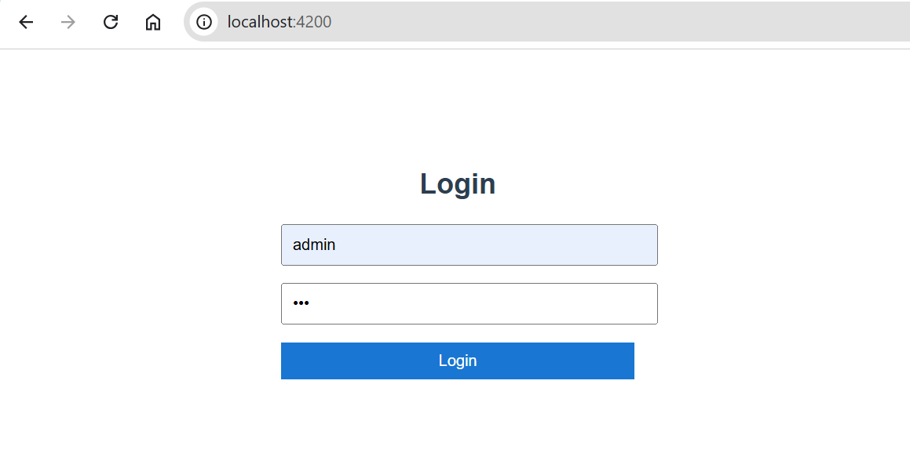
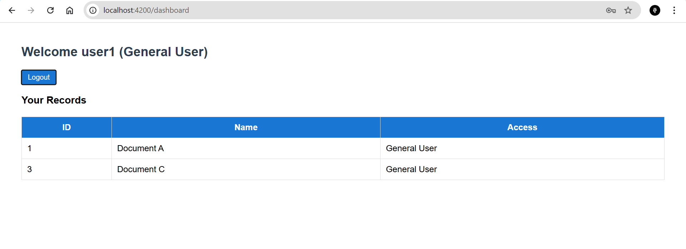
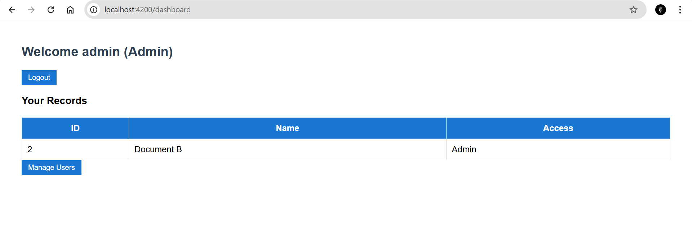
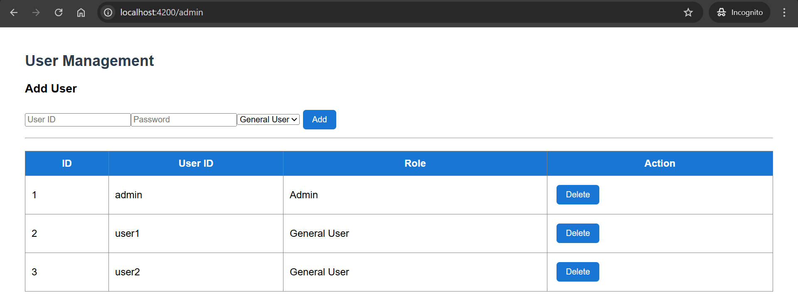
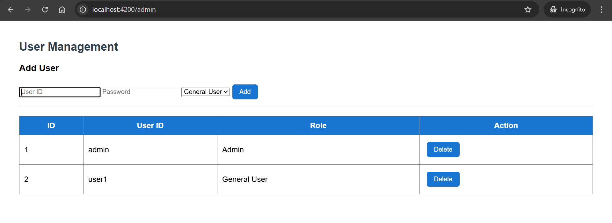

# 🚀 NSQTech Fullstack Project

A role-based Single Page Application (SPA) built using **Angular 12+** and **Node.js (Express)** demonstrating authentication, authorization, modular architecture, and REST API integration.

---

## 📌 Project Overview

This application simulates a real-world role-based system with:

- Login Authentication
- Role-based Access Control
- Protected Routes using Guards
- Admin User Management
- JWT Interceptor
- Modular Angular Architecture
- REST API Integration
- Async API Handling

---

## 🛠 Tech Stack

### 🔹 Frontend
- Angular 12+
- TypeScript
- Angular Route Guards
- JWT Interceptor
- Modular Architecture (Core & Shared Modules)

### 🔹 Backend
- Node.js
- Express.js
- REST APIs
- JSON-based Data Storage

---

## 👤 Application Roles

### 🟢 General User
- Login Authentication
- View only permitted records
- Protected Dashboard

### 🔴 Admin User
- Login Authentication
- View Admin-specific records
- Manage Users (Add/Delete)
- Role Assignment
- Protected Admin Routes

---

## 📸 Screenshots

---

### 🔐 Login Page



---

### 👤 General User Dashboard



---

### 🛡 Admin Dashboard



---

### ⚙ Admin User Management





---

## 🔐 Security Features

- Route Protection using `AuthGuard`
- Role-based Authorization using `AdminGuard`
- JWT Interceptor for secured API communication
- Role validation before accessing routes

---

## 📂 Project Structure

```
nsqtech-fullstack/
│
├── nsqtech-backend/
│ ├── server.js
│ ├── users.json
│
├── nsqtech-frontend/
│ ├── core/
│ │ └── interceptors/
│ ├── shared/
│ │ └── spinner/
│ ├── modules/
│ │ ├── auth/
│ │ └── dashboard/
│
├── screenshots/
│
└── README.md
```
---


---

## ⚡ How to Run the Project

### 🔹 Backend

cd nsqtech-backend

npm install

node server.js


Backend runs on:

http://localhost:3000

---

### 🔹 Frontend

cd nsqtech-frontend

npm install

ng serve


Frontend runs on:

http://localhost:4200

---

## 🎯 Evaluation Focus Areas Covered

- Effective Angular Framework Usage
- Clean Modular Architecture
- Role-based Authentication
- API Integration
- Async Handling
- Clean UI Layout
- Code Separation & Reusability

---

## 👨‍💻 Developed By

**Krantikumar Patil**  
